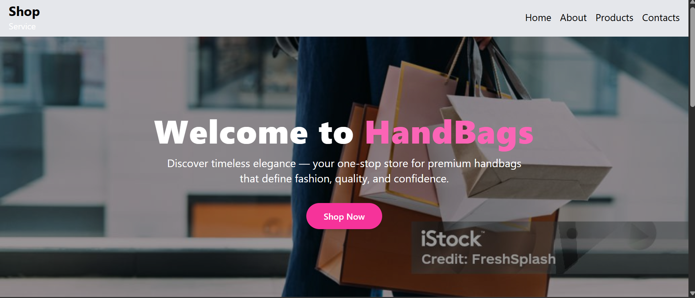

#  Static E-commerce Homepage

A simple and modern **static e-commerce homepage** built using **React**, **Tailwind CSS**, and **React Router DOM**.  
This project showcases a clean online store layout with navigation across multiple pages — ideal for learning or demonstrating frontend development skills.

---

##  **Project Overview**

This project represents a **handbag store** landing page with multiple sections:  
- A visually appealing homepage introducing the brand.  
- A product listing page displaying various handbags with prices and images.  
- An about page describing the store.  
- A contact page with a working contact form.  

It’s designed to demonstrate responsive layouts, routing, and component-based design in React.

---

##  **List of Pages**

| Page | Description |
|------|--------------|
| **Home** | Displays the store introduction and featured section. |
| **Products** | Lists available handbags with images, names, and prices. |
| **About** | Provides store details, mission, and background information. |
| **Contact** | Contains a form to reach out to the store or brand. |

---

##  **Technologies Used**

- **React** — Frontend library for building the UI.  
- **Tailwind CSS** — Utility-first CSS framework for responsive styling.  
- **React Router DOM** — Enables navigation between pages.  
- **Vite** — Fast build tool and local development server.

---

## **Screenshot**

Below is a preview of the homepage:
(./src/assets/image.png)


## **Deployment Link**

**Live Demo:** 


## **Folder Structure**
Handbags-react/
|__e-commerce
  |
├── public/
│ └── index.html
├── src/
│ ├── assets/
│ │ ├── image1.jpg
│ │ ├── image2.jpg
│ │ ├── ...
│ ├
│ │ ├── Header.jsx
│ │ ├── Footer.jsx
│ ├
│ │ ├── Home.jsx
│ │ ├── Products.jsx
│ │ ├── About.jsx
│ │ ├── Contacts.jsx
│ ├── App.jsx
│ ├── main.jsx
│ └── index.css
├── package.json
├── tailwind.config.js
├── postcss.config.js
└── README.md

#  **Installation & Setup Instructions**

Follow the steps below to **clone and run** the project locally 

### 1️⃣ Clone the repository
```bash
git clone https://github.com/yourusername/Handbags-react.git

2️⃣ Navigate into project folder:cd Handbags-react
3️⃣ Install dependencies: npm install
4️⃣ Run the development server: npm run dev


